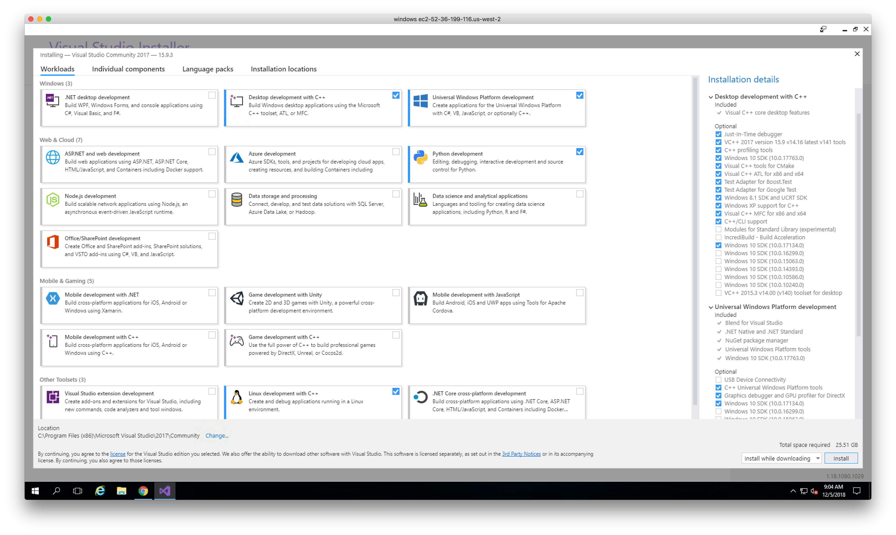

# building on Windows Server 2016

## refs

* https://github.com/aescande/log4cxxWin32

## APR

https://apr.apache.org/download.cgi
http://archive.apache.org/dist/apr/

* apr 1.5.2
* apt-util 1.5.4

## log4cxx

https://archive.apache.org/dist/logging/log4cxx/0.10.0/

* apache-log4cxx 0.10.0

## steps

### install Google Chrome

IE sucks

### install Visual Studio 2017

https://visualstudio.microsoft.com/downloads/

### install Cygwin

https://cygwin.com/setup-x86_64.exe

consider selecting:
* python
* shells

### install choco

https://chocolatey.org/

following instructions on https://chocolatey.org/install :

    Microsoft Windows [Version 10.0.14393]
    (c) 2016 Microsoft Corporation. All rights reserved.

    C:\Windows\system32>@"%SystemRoot%\System32\WindowsPowerShell\v1.0\powershell.exe" -NoProfile -InputFormat None -ExecutionPolicy Bypass -Command "iex ((New-Object System.Net.WebClient).DownloadString('https://chocolatey.org/install.ps1'))" && SET "PATH=%PATH%;%ALLUSERSPROFILE%\chocolatey\bin"
    Getting latest version of the Chocolatey package for download.
    Getting Chocolatey from https://chocolatey.org/api/v2/package/chocolatey/0.10.11.
    Downloading 7-Zip commandline tool prior to extraction.
    Extracting C:\Users\ADMINI~1\AppData\Local\Temp\2\chocolatey\chocInstall\chocolatey.zip to C:\Users\ADMINI~1\AppData\Local\Temp\2\chocolatey\chocInstall...
    Installing chocolatey on this machine
    Creating ChocolateyInstall as an environment variable (targeting 'Machine')
      Setting ChocolateyInstall to 'C:\ProgramData\chocolatey'
    WARNING: It's very likely you will need to close and reopen your shell
      before you can use choco.
    Restricting write permissions to Administrators
    We are setting up the Chocolatey package repository.
    The packages themselves go to 'C:\ProgramData\chocolatey\lib'
      (i.e. C:\ProgramData\chocolatey\lib\yourPackageName).
    A shim file for the command line goes to 'C:\ProgramData\chocolatey\bin'
      and points to an executable in 'C:\ProgramData\chocolatey\lib\yourPackageName'.

    Creating Chocolatey folders if they do not already exist.

    WARNING: You can safely ignore errors related to missing log files when
      upgrading from a version of Chocolatey less than 0.9.9.
      'Batch file could not be found' is also safe to ignore.
      'The system cannot find the file specified' - also safe.
    chocolatey.nupkg file not installed in lib.
     Attempting to locate it from bootstrapper.
    PATH environment variable does not have C:\ProgramData\chocolatey\bin in it. Adding...
    WARNING: Not setting tab completion: Profile file does not exist at
    'C:\Users\Administrator\Documents\WindowsPowerShell\Microsoft.PowerShell_profile.ps1'.
    Chocolatey (choco.exe) is now ready.
    You can call choco from anywhere, command line or powershell by typing choco.
    Run choco /? for a list of functions.
    You may need to shut down and restart powershell and/or consoles
     first prior to using choco.
    Ensuring chocolatey commands are on the path
    Ensuring chocolatey.nupkg is in the lib folder

    > choco install -y python cmake git patch curl cppcheck

