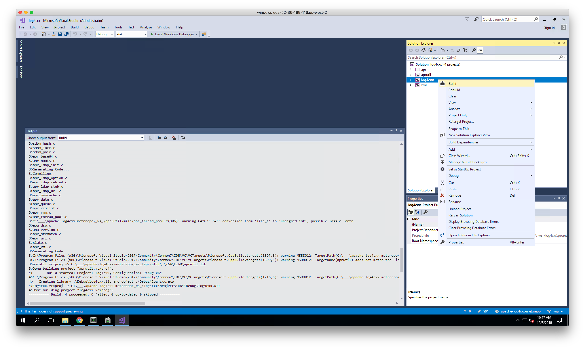

# building on Windows Server 2016

## refs

* https://github.com/aescande/log4cxxWin32

## APR

https://apr.apache.org/download.cgi
http://archive.apache.org/dist/apr/

* apr 1.5.2
* apt-util 1.5.4

## log4cxx

https://archive.apache.org/dist/logging/log4cxx/0.10.0/

* apache-log4cxx 0.10.0

## steps

### install Google Chrome

IE sucks

### install Visual Studio 2017

https://visualstudio.microsoft.com/downloads/

### install Cygwin

https://cygwin.com/setup-x86_64.exe

consider selecting:
* python
* shells
* gcc
* gnumake

### build

